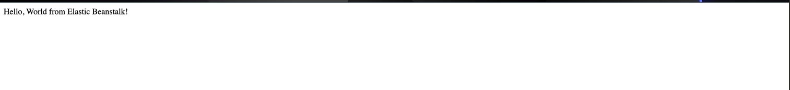

# Flask Hello World on Elastic Beanstalk

This is a simple Flask application deployed on **AWS Elastic Beanstalk**.



## Usage

Visit the Elastic Beanstalk URL to see the app serving a “Hello, World” request.


---

## Table of Contents

- [Requirements](#requirements)  
- [Setup](#setup)  
- [Project Structure](#project-structure)  
- [Creating a Virtual Environment](#creating-a-virtual-environment)  
- [Running Locally](#running-locally)  
- [AWS Elastic Beanstalk Deployment](#aws-elastic-beanstalk-deployment)  
- [Troubleshooting](#troubleshooting)  

---

## Requirements

- Python 3.10+  
- pip  
- AWS account with access to Elastic Beanstalk  
- AWS CLI installed and configured  
- EB CLI installed  

---

## Setup

1. Clone the repository:

```bash
git clone <your-repo-url>
cd flask-hello-eb